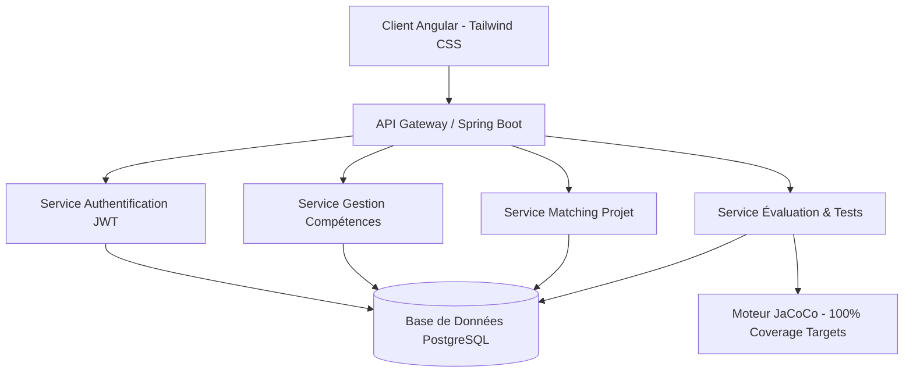

<div align="center">
  
  <h1>SkillMap - Plateforme de Gestion des Compétences</h1>
  
  <p>
    
    
    
    
    
  </p>
</div>

---

## 🚀 À Propos

**SkillMap** est une solution d'entreprise moderne dédiée à la cartographie et au développement des talents. Elle permet de transformer le capital humain en avantage stratégique en offrant une visibilité en temps réel sur les compétences, en automatisant les processus d'évaluation et en optimisant l'affectation des ressources sur les projets.

### 🌟 Vision Professionnelle
SkillMap ne se contente pas de stocker des données ; elle les rend actionnables grâce à un design intuitif (Tailwind CSS) et une architecture robuste (Spring Boot & Angular).

---

## ✨ Fonctionnalités Clés

### 👔 Espace Manager
- **Tableau de Bord Premium** : Vue d'ensemble de la performance de l'équipe avec des KPIs visuels.
- **Assignation de Tests** : Création et envoi de tests techniques ciblés aux collaborateurs.
- **Validation des Compétences** : Système de revue et de validation des auto-évaluations.

### 💼 Espace RH & Admin
- **Gestion du Référentiel** : Administration complète des compétences (Hard & Soft) et des formations.
- **Planification de Formation** : Catalogage et suivi des sessions de montée en compétences.
- **Gouvernance des Utilisateurs** : Gestion granulaire des rôles et des accès.

### 🏗️ Espace Chef de Projet
- **Management de Projet** : Cycle de vie complet des projets, du démarrage à la clôture.
- **Affectation Intelligente** : Matching basé sur les compétences réelles vs. requises.
- **Suivi de Progression** : Visualisation en temps réel de l'état des livrables.

### 👤 Espace Employé
- **Auto-évaluation** : Déclaration et mise à jour du profil de compétences.
- **Passage de Tests** : Environnement d'examen technique intégré.
- **Parcours de Formation** : Accès au catalogue et suivi des inscriptions.

---

## 🏛️ Architecture Technique



### 🛠️ Stack Technologique
- **Frontend** : Angular 18+, Tailwind CSS, Material UI, RxJS.
- **Backend** : Spring Boot 3+, Spring Security (JWT), Hibernate/JPA.
- **Base de Données** : PostgreSQL.
- **DevOps & Testing** : Docker Compose, JaCoCo (Code Coverage), JUnit 5, Mockito.

---

## ⚙️ Installation et Lancement

### 🐳 Option 1 : Docker Compose (Recommandé)
Pour lancer l'environnement complet en une seule étape :
```bash
docker-compose up --build
```
- **Frontend** : `http://localhost:4200`
- **Backend** : `http://localhost:8085`
- **API Docs** : `http://localhost:8085/swagger-ui.html`

### 💻 Option 2 : Développement Local

#### Backend
```bash
cd backend
mvn clean install
mvn spring-boot:run
```

#### Frontend
```bash
cd frontend
npm install
npm run start
```

---

## 🧪 Qualité & Tests (JaCoCo)

Le projet intègre **JaCoCo** pour garantir une qualité de code exceptionnelle. Plusieurs services critiques et contrôleurs visent un taux de couverture de **100 %**.

Pour générer le rapport de couverture :
```bash
mvn test
# Rapport disponible dans : backend/target/site/jacoco/index.html
```

---

## 📄 Licence
Ce projet est développé dans le cadre de la soutenance académique pour la plateforme **SkillMap**.

---
<div align="center">
  <sub>Développé par l'équipe SkillMap - 2026</sub>
</div>